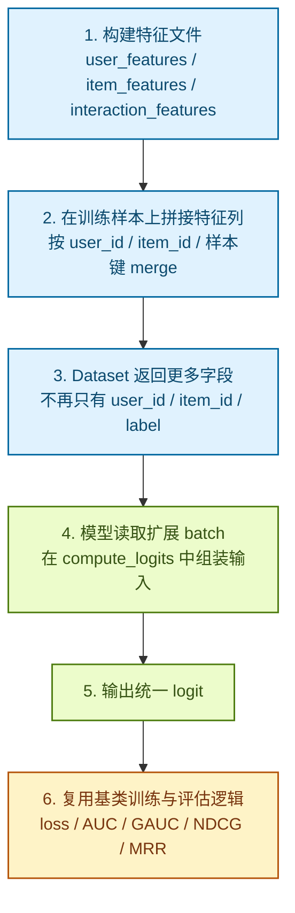
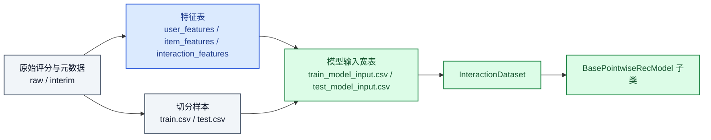

# 给推荐模型接入额外特征的详细流程

## 1. 文档目的

这份文档专门说明，在当前 `MovieLens-1M_Rec` 项目里，如何从现有的 `user_id + item_id` 双塔输入，扩展到“用户特征 + 物品特征 + 交互特征 + 上下文特征”的多特征输入模型。

目标不是只讲概念，而是回答下面几个实际问题：

- 现在代码为什么只能吃 `user_id` 和 `item_id`
- 如果要加特征，应该改哪些文件
- 特征应该放在哪一层处理
- 新模型应该怎么继承当前基类
- 训练和评估阶段怎样保证口径不乱

---

## 2. 当前代码为什么只支持 `user_id` 和 `item_id`

当前主链路里，模型输入被限定在两个字段上：

- 数据集只返回 `user_id`、`item_id`、`label`
  - 见 [src/recsys/data/dataset.py](/Users/zhy/Desktop/MovieLens-1M_Rec/src/recsys/data/dataset.py:12)
- 基类默认只从 batch 里读取 `user_id` 和 `item_id`
  - 见 [src/recsys/models/base.py](/Users/zhy/Desktop/MovieLens-1M_Rec/src/recsys/models/base.py:41)
- `DeepModel` 的前向接口也只有 `forward(user_ids, item_ids)`
  - 见 [src/recsys/models/deep.py](/Users/zhy/Desktop/MovieLens-1M_Rec/src/recsys/models/deep.py:56)

因此，当前特征脚本虽然已经能产出用户、物品、交互侧特征文件：

- [src/recsys/features/user_features.py](/Users/zhy/Desktop/MovieLens-1M_Rec/src/recsys/features/user_features.py:1)
- [src/recsys/features/item_features.py](/Users/zhy/Desktop/MovieLens-1M_Rec/src/recsys/features/item_features.py:1)
- [src/recsys/features/interaction_features.py](/Users/zhy/Desktop/MovieLens-1M_Rec/src/recsys/features/interaction_features.py:1)

这些特征目前还没有真正进入训练 batch。

---

## 3. 整体接入思路

推荐采用下面这条主线：



最核心的原则有两条：

1. `BasePointwiseRecModel` 不动训练协议，只扩 batch 内容。
2. 复杂输入尽量通过覆写 `compute_logits(batch)` 来接，不要强行把所有模型的 `forward(...)` 都改成同一个复杂签名。

---

## 4. 当前项目里特征都来自哪里

### 4.1 用户特征

当前已经有的用户侧特征构建逻辑在：

- [src/recsys/features/user_features.py](/Users/zhy/Desktop/MovieLens-1M_Rec/src/recsys/features/user_features.py:7)

目前产出字段主要包括：

- `user_id`
- `gender`
- `age`
- `occupation`
- `gender_code`

其中：

- `gender_code` 属于离散稀疏特征，适合做 embedding 或 one-hot
- `age` 可以直接做数值特征，也可以离散化成年龄桶后做 embedding
- `occupation` 是离散类别特征，通常适合做 embedding

### 4.2 物品特征

当前物品侧特征构建逻辑在：

- [src/recsys/features/item_features.py](/Users/zhy/Desktop/MovieLens-1M_Rec/src/recsys/features/item_features.py:9)

目前产出字段主要包括：

- `item_id`
- `title`
- `genres`
- `release_year`
- `genre_count`

其中：

- `release_year` 可以做数值特征、分桶特征，或者转成年代 embedding
- `genre_count` 是稠密数值特征
- `genres` 是典型多值离散特征，通常不能直接喂模型，最好先拆成 multi-hot 或 embedding pooling

### 4.3 交互特征

当前交互侧特征构建逻辑在：

- [src/recsys/features/interaction_features.py](/Users/zhy/Desktop/MovieLens-1M_Rec/src/recsys/features/interaction_features.py:7)

目前产出字段主要包括：

- `user_id`
- `item_id`
- `timestamp`
- `user_interaction_count`
- `item_interaction_count`

其中：

- `user_interaction_count` 和 `item_interaction_count` 是典型的统计型稠密特征
- `timestamp` 更适合进一步派生，例如小时、星期、时间间隔、最近活跃度

---

## 5. 推荐把特征分成四类来处理

为了避免数据侧和模型侧实现混乱，建议先把特征分类。

| 特征类型 | 例子 | 推荐表示方式 | 模型里常见处理 |
| --- | --- | --- | --- |
| ID 特征 | `user_id`、`item_id` | 连续整数 | `Embedding` |
| 离散单值特征 | `gender_code`、`occupation` | 连续整数编码 | `Embedding` |
| 稠密数值特征 | `age`、`genre_count`、`user_interaction_count` | `float32` | 直接拼接或过 `Linear` |
| 离散多值特征 | `genres` | `list[int]`、multi-hot、mask | `EmbeddingBag`、平均池化、sum pooling |

如果不先分类，后面最容易出现的问题是：

- 离散特征被错误地当作连续数值
- 多值特征被错误地只保留一个值
- 数值特征没有标准化，导致训练不稳定

---

## 6. 建议优先采用的接入路径

建议分两阶段做，不要一步到位把所有特征都塞进去。

### 6.1 第一阶段：先接“单值、易处理”的特征

优先接这些：

- 用户：`gender_code`、`age`、`occupation`
- 物品：`release_year`、`genre_count`
- 交互：`user_interaction_count`、`item_interaction_count`

原因：

- 都是单值列
- merge 逻辑简单
- `Dataset` 返回张量容易
- 不需要处理变长输入

### 6.2 第二阶段：再接“多值、复杂”的特征

后续再接这些：

- `genres`
- 用户历史序列
- 更复杂的上下文特征

原因：

- 这些通常需要 padding、mask、pooling 或专门的序列结构
- 会直接影响 batch 结构和模型前向签名

---

## 7. 代码上到底要改哪些地方

接入特征通常会涉及四层改动。

### 7.1 特征构建层

入口脚本：

- [scripts/build_features.py](/Users/zhy/Desktop/MovieLens-1M_Rec/scripts/build_features.py:1)

职责：

- 从 `interim` 表里生成用户、物品、交互侧特征文件
- 保存到 `data/artifacts/`

这一层建议做的事情：

- 原子化地生成“干净特征表”
- 尽量保证每张特征表都带明确主键
- 不在这里直接混入训练集、测试集

建议主键规范：

- 用户特征表：主键 `user_id`
- 物品特征表：主键 `item_id`
- 交互特征表：至少有 `user_id + item_id`，更严格时可加 `timestamp`

### 7.2 样本拼接层

这是当前项目还没显式抽出来，但后面应该补的一层。

推荐新增一个样本拼接模块，例如：

- `src/recsys/data/sample_builder.py`

它的职责是：

- 读取 `train.csv` / `test.csv`
- 读取 `user_features.csv` / `item_features.csv` / `interaction_features.csv`
- 按主键 merge 成最终训练样本表

推荐流程：

1. 用 `train.csv` 和 `test.csv` 作为主表
2. 按 `user_id` merge 用户特征
3. 按 `item_id` merge 物品特征
4. 按 `user_id + item_id (+ timestamp)` merge 交互特征
5. 保存成模型训练真正使用的样本文件，例如：
   - `data/processed/train_with_features.csv`
   - `data/processed/test_with_features.csv`

为什么推荐单独做这一层：

- 不要让 `Dataset` 在 `__getitem__` 时动态查表，太慢
- 不要让模型自己去 join 特征，职责错误
- 训练样本落盘后更容易排查列缺失、类型错误、空值问题

### 7.3 Dataset 层

当前文件：

- [src/recsys/data/dataset.py](/Users/zhy/Desktop/MovieLens-1M_Rec/src/recsys/data/dataset.py:12)

当前它只返回：

```python
{
    "user_id": ...,
    "item_id": ...,
    "label": ...,
}
```

加特征后，应该扩展成返回更多字段，例如：

```python
{
    "user_id": ...,
    "item_id": ...,
    "label": ...,
    "gender_code": ...,
    "age": ...,
    "occupation": ...,
    "release_year": ...,
    "genre_count": ...,
    "user_interaction_count": ...,
    "item_interaction_count": ...,
}
```

如果是多值特征，例如 `genres`，则可能返回：

```python
{
    "genre_ids": ...,
    "genre_mask": ...,
}
```

`Dataset` 层建议遵守两个原则：

- 只负责把 DataFrame 行转成张量
- 不负责做复杂业务逻辑或动态 join

### 7.4 模型层

当前基类在：

- [src/recsys/models/base.py](/Users/zhy/Desktop/MovieLens-1M_Rec/src/recsys/models/base.py:15)

当前 `DeepModel` 在：

- [src/recsys/models/deep.py](/Users/zhy/Desktop/MovieLens-1M_Rec/src/recsys/models/deep.py:28)

这里最重要的扩展点是：

- [src/recsys/models/base.py](/Users/zhy/Desktop/MovieLens-1M_Rec/src/recsys/models/base.py:41) 的 `compute_logits(batch)`

默认实现是：

- 从 batch 里取 `user_id`
- 从 batch 里取 `item_id`
- 调用 `forward(user_ids, item_ids)`

如果你要接额外特征，最推荐的方式是：

- 保留基类不变
- 在具体模型里覆写 `compute_logits(batch)`

这样训练和测试协议都还能复用。

---

## 8. 为什么推荐覆写 `compute_logits(batch)`，而不是强改基类 `forward`

这是当前框架里最关键的设计点。

### 8.1 方案 A：所有模型都强制改成复杂 `forward`

例如：

```python
def forward(
    self,
    user_ids,
    item_ids,
    gender_code,
    age,
    occupation,
    release_year,
    genre_count,
    user_interaction_count,
    item_interaction_count,
):
    ...
```

这个方案的问题：

- 简单模型也要被迫带一堆不用的参数
- 后续每加一个特征，所有模型签名都要改
- 很容易出现参数顺序错位

### 8.2 方案 B：基类只认 batch，复杂模型自己解析

推荐做法：

```python
def compute_logits(self, batch):
    user_vec = self.user_embedding(batch["user_id"])
    item_vec = self.item_embedding(batch["item_id"])
    gender_vec = self.gender_embedding(batch["gender_code"])
    dense_vec = torch.stack(
        [
            batch["age"],
            batch["genre_count"],
            batch["user_interaction_count"],
            batch["item_interaction_count"],
        ],
        dim=-1,
    )
    ...
```

这个方案的好处：

- 简单模型继续只实现 `forward(user_ids, item_ids)`
- 复杂模型按自己需要消费 batch
- 基类的训练、测试、指标逻辑完全不需要改

结论：

在这个项目里，推荐把 `compute_logits(batch)` 作为“多特征模型正式入口”。

---

## 9. 一个推荐的落地实现方案

下面给一个贴合当前仓库结构的推荐实现顺序。

### 9.1 第一步：新增样本拼接脚本

建议新增：

- `scripts/build_model_inputs.py`
- `src/recsys/data/sample_builder.py`

职责：

- 将 `processed/train.csv`、`processed/test.csv` 与特征文件拼接
- 输出训练真正使用的宽表样本

推荐输出：

- `data/processed/train_model_input.csv`
- `data/processed/test_model_input.csv`

### 9.2 第二步：扩展 `InteractionDataset`

让 `InteractionDataset` 支持按列名配置返回字段。

例如新增一个接口风格：

```python
dataset = InteractionDataset(
    interactions=frame,
    sparse_columns=["user_id", "item_id", "gender_code", "occupation"],
    dense_columns=["age", "genre_count", "user_interaction_count", "item_interaction_count"],
)
```

这样好处是：

- 同一个 `Dataset` 可以服务简单模型和复杂模型
- 不需要为每个模型都单独写一个数据集类

### 9.3 第三步：新增一个多特征模型样板

例如新增：

- `src/recsys/models/deep_fm_like.py`
- 或 `src/recsys/models/deep_with_features.py`

该模型继承：

- [BasePointwiseRecModel](/Users/zhy/Desktop/MovieLens-1M_Rec/src/recsys/models/base.py:15)

模型中做的事情：

- 对 `user_id`、`item_id`、`gender_code`、`occupation` 做 embedding
- 对数值特征做拼接或一层投影
- 将所有向量 concat 后送入 MLP
- 输出一个统一 logit

### 9.4 第四步：在 `MODEL_REGISTRY` 注册新模型

注册点：

- [src/recsys/models/__init__.py](/Users/zhy/Desktop/MovieLens-1M_Rec/src/recsys/models/__init__.py:8)

这样训练入口 [scripts/train.py](/Users/zhy/Desktop/MovieLens-1M_Rec/scripts/train.py:26) 不需要改。

---

## 10. 推荐的数据流设计

推荐把“特征生成”和“模型输入样本生成”分开：



这种设计的好处：

- 特征表可以复用给多个模型
- 宽表是最终训练证据，更容易 debug
- 换模型时，不需要重写特征构建逻辑

---

## 11. 评估阶段要不要改

通常不需要改基类评估流程。

当前测试指标逻辑在：

- [src/recsys/models/base.py](/Users/zhy/Desktop/MovieLens-1M_Rec/src/recsys/models/base.py:88)
- [src/recsys/metrics.py](/Users/zhy/Desktop/MovieLens-1M_Rec/src/recsys/metrics.py:89)

只要你的新模型最后还能输出：

- 一条样本一个 `logit`
- batch 里仍然保留 `user_id`
- batch 里仍然保留 `label`

那么：

- `AUC`
- `Logloss`
- `GAUC`
- `NDCG`
- `MRR`

都能继续复用当前测试逻辑。

真正需要注意的是：

- 不要在拼接特征时把 `user_id` 丢掉
- 不要在 `Dataset` 里改掉 `label` 的含义
- 不要让测试阶段和训练阶段使用不同的特征处理口径

---

## 12. 一份最小可行的改造清单

如果你想尽快把“额外特征接进模型”跑通，建议按下面顺序改。

1. 保持现有 `build_features.py` 不动。
2. 新增 `sample_builder.py`，把特征 merge 到 `train/test` 样本上。
3. 让 `InteractionDataset` 支持返回更多字段。
4. 新增一个 `DeepWithFeaturesModel`，继承 `BasePointwiseRecModel`。
5. 在 `compute_logits(batch)` 中消费额外特征。
6. 在 `MODEL_REGISTRY` 中注册新模型。
7. 加测试，至少覆盖：
   - merge 后列是否齐全
   - `Dataset` 是否返回新增字段
   - 新模型前向是否成功
   - `trainer.test()` 是否还能正常记录指标

---

## 13. 推荐的测试点

接特征后，最容易坏的地方不在模型，而在数据协议。

建议至少补这些测试：

| 测试目标 | 建议内容 |
| --- | --- |
| 特征表主键唯一性 | 用户表按 `user_id` 唯一，物品表按 `item_id` 唯一 |
| merge 完整性 | 训练样本 merge 后关键特征列无缺失 |
| 类型正确性 | 离散特征是整数，稠密特征是浮点数 |
| Dataset 协议稳定 | 返回字段名和张量 shape 符合预期 |
| 模型前向稳定 | 复杂 batch 下能输出 `(batch_size,)` 的 logit |
| 评估兼容性 | `trainer.test()` 后仍能产出 `test_auc/test_gauc/test_ndcg/test_mrr` |

---

## 14. 常见坑

### 14.1 在 `Dataset.__getitem__` 动态查特征表

不推荐。

原因：

- 每条样本都查表会拖慢训练
- 逻辑分散，不方便排查
- 多进程 DataLoader 下更容易出问题

### 14.2 直接把原始字符串喂给模型

不推荐。

例如：

- `gender = "M"`
- `genres = "Action|Comedy"`

模型不能直接消费这些字符串，必须先编码。

### 14.3 把训练和测试做成不同的特征流程

这是最危险的问题之一。

例如：

- 训练集用了标准化后的 `age`
- 测试集用了原始 `age`

这会让评估结果失真。

### 14.4 多值特征没有定义聚合方式

例如 `genres` 是多标签：

- 是做 multi-hot
- 还是做多个 genre embedding 的平均
- 还是只取主 genre

必须提前定规则，否则实验不可复现。

---

## 15. 推荐的最终代码形态

如果未来要稳定支持多特征模型，建议项目逐步演进成下面这种结构：

```text
src/recsys/
├── data/
│   ├── dataset.py
│   ├── datamodule.py
│   └── sample_builder.py
├── features/
│   ├── user_features.py
│   ├── item_features.py
│   └── interaction_features.py
├── models/
│   ├── base.py
│   ├── deep.py
│   ├── deep_with_features.py
│   └── __init__.py
└── metrics.py
```

职责划分：

- `features/` 负责构造特征表
- `sample_builder.py` 负责把特征表拼到训练样本
- `dataset.py` 负责张量化
- `base.py` 负责统一训练与评估协议
- 具体模型文件只负责网络结构和输入消费

---

## 16. 结论

在当前仓库里，加特征不是“改一个模型文件”就够了，而是一个四层联动过程：

1. 先构建干净的特征表
2. 再把特征表拼接到训练样本
3. 再让 `Dataset` 把这些列转成 batch
4. 最后让具体模型在 `compute_logits(batch)` 里消费这些特征

最推荐的落地方式是：

- 保持 [BasePointwiseRecModel](/Users/zhy/Desktop/MovieLens-1M_Rec/src/recsys/models/base.py:15) 的训练和评估协议不变
- 用新的样本拼接层来稳定数据协议
- 用具体模型覆写 `compute_logits(batch)` 来支持复杂输入

这样后面无论你加 `Wide&Deep`、`DeepFM`、`DCN`，还是带上下文特征的 MLP，训练和测试口径都能保持一致。
